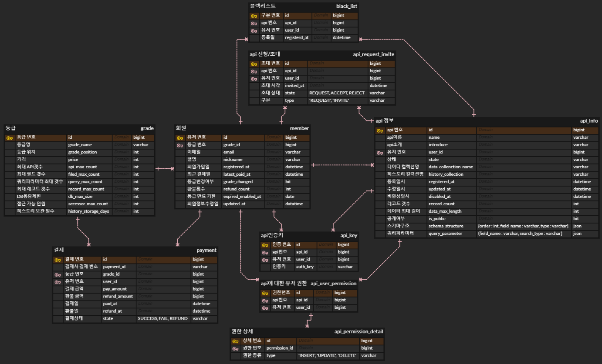

# OpenAPI 간단 구축 서비스(Open Api Simple Generator)

---

### 프로젝트 개요

- 본 프로젝트는 스프링부트 기반의 백엔드 프로젝트입니다.


- 공공데이터 포털에서 **OpenAPI**를 사용하여, 데이터를 조회할 수 있듯이
유저가 직접 데이터의 구조를 정의하고, 엑셀파일로 데이터를 올려 유저의 커스텀 데이터를 조회할 수 있는 서비스 입니다.


- 자신이 만든 **OpenAPI**를 사용하여, 추가적인 **API서버** 없이 원격으로 데이터를 추가하고, 수정할 수 있습니다.


- 이를 사용하여 유연한 데이터를 제공하는 **스마트폰앱**, **데스크탑앱**을 제작할 수 있게 도와줍니다.

### 프로젝트 기능 상세

**[카카오 소셜로그인]**

- 카카오 OpenAPI를 사용하여, 로그인을 진행합니다.
- 로그인이 성공할 경우, 내부적으로 데이터를 저장하고, JWT을 발급하여 응답함.

**[OpenAPI 검색]**
- 공개여부가 열려있는 OpenAPI에 한해서, 검색할 수 있습니다.
- 또한, 검색된 OpenAPI를 신청할 수 있습니다.

**[OpenAPI 조회]**

- 현재 자신이 소유한 OpenAPI목록들을 조회할 수 있습니다.

**[OpenAPI 등록]**

- 스키마 데이터(필드명 : 자료형)와, 스키마 규격에 맞춘 엑셀데이터(.xls, .xlsx파일),
검색시 사용될 질의 인수 정보(필드명 : 검색타입) 을 서버에 제출하여, 서버에서 해당 데이터를 바탕으로,
MongoDB에 컬렉션과, 인덱스를 생성하고, 데이터를 삽입해줍니다.
- 요청한 스키마와 엑셀 데이터가 일치하지 않을 경우에는, 데이터 생성을 취소합니다.
- 질의 인수는 타입에 따라 다음과 같습니다.
- 문자열(String) : INCLUDE(단어포함), START(앞부분일치), EQUAL(일치)
- 그 외 : EQUAL(일치), GT(큼), GTE(이상), LT(작음), LTE(이하)

**[OpenAPI 관리]**

- 해당 OpenAPI에 등록되어있는 데이터를 수정합니다.
- 수정 시에, 보여주는 데이터는 페이징 처리되어 보여주도록 합니다.
- 수정 시에, 스키마 구조에 따라 올바르게 데이터가 입력되었는지 서버단에서 검증합니다.
- 일부 데이터를 제거하는 것도 가능합니다.
- OpenAPI자체를 삭제할 수도 있습니다. 연쇄적으로 초대한 사람들의 해당 API도 삭제됩니다.
- 등급에 충족이 될경우, 특정 API를 활성화를 수행할 수 있습니다.
- 단, 비활성화는 악용의 여지가 있어 수행이 불가능합니다.

**[등급에 따른 제한 시스템]**

- '브론즈', '실버', '골드', '다이아몬드' 와 같은 회원제로 운영합니다.
- '브론즈'는 무료로 이용이 가능합니다.
- 등급별로 제약되는 사항은 다음과 같습니다.
- ```API갯수, API당 접근가능인원, 필드 갯수, 레코드 갯수, DB용량제한, 쿼리파라미터 갯수, 히스토리 보존일```

**[등급 결제 시스템]**

- 카카오 OpenAPI를 사용하여, 카카오페이로 결제를 수행합니다.
- 이미 결제가 진행되어, 등급이 지정되었다면 환불처리를 수행하고 재결제를 수행하여야 합니다.
- 환불금액은, 당일은 전액환불, 이후에는 결제 금액 * ((현재 - 결제일) / 30) 로 정의합니다.
- 환불은 결제일로부터 7일 이내로 수행이 가능합니다.
- 환불시, 전 API는 비활성화 됩니다.
- 환불시, 등급은 BRONZE로 강등됩니다.
- 환불시, 등급 유지 일수는 0일이 됩니다.
- 환불을 2회 이상 진행한 경우에는, 환불은 수행가능하지만 한 달간 결제 진행이 불가능합니다.
- 결제일로부터 해당 등급을 유지하는 기한 30일이 부여됩니다.
- 등급 유지 기한이 1일이 남은 날에, 동등급 이상으로 재결제를 수행하지 않을경우, 다음날 새벽에 소유한 전 API가 비활성화 됩니다.

**[재결제 미스로 인한 API활성화]**

- 재결제가 수행되지 않을 경우, 모든 OpenAPI가 비활성화 됩니다.
- 단, 최근 결제 등급의 이하 등급으로 재결제 한 경우는 직접 API를 활성화 시켜야 합니다.
- 이 때, 등급의 조건에 맞는 API만 활성화 시킬 수 있으며, 2주 이내에 활성화 시키지 못할 경우, API는 영구 삭제 조치됩니다.

**[유지 일수 및 등급에 따른 스케줄러]**

- 스케줄러는 새벽 0시 5분에 수행됩니다.
- 등급 유지 일수를 재 할당 합니다. 등급 유지 일수 = min(등급 유지 일수 - 1, 0)
- 등급 유지 일수가 0인 경우에는, 해당 Member 소유한 전 API를 비활성화 조치를 수행합니다.
- 등급데이터와 유저가 소유한 API데이터를 불러와, 적합하지 않는 API가 존재할 경우, 유저의 전 API를 비활성화 조치함.(등급 변경 이슈)
- 비활성된 API가 2주 이상 경과 되었을 경우에, 공간 확보를 위해 API데이터를 영구삭제하는 조치를 선택합니다.


**[인증키 발급 서비스]**

- 각 OpenAPI에 대해 인증키를 발급할 수 있습니다.
- 인증키가 유출될 시를 대비하여, 인증키를 재발급할 수 있습니다.

**[OpenAPI 질의 및 페이징]**

- 실제로 OpenAPI를 사용하는 컨트롤러가 필요합니다.
- /query/{api_id}/{auth_key}/{page_idx}?{query parameter}=xxx&{query parameter2}=xxxx
- 이와 같은 형태로 질의가 가능하며, 쿼리 파라미터는 스프링부트에서는 가변적으로 받을 수 있어야 합니다.(Map사용)
- 받아온 쿼리파라미터를 사전에 생성할 때 정의된 질의 인수로 비교하여, 유효성 검사를 수행합니다.
- 사전에 정의된 질의 인수에 맞게 요청된 쿼리파라미터를 대입하여, 몽고DB에 질의합니다.
- 페이징은, 기본적으로 100개씩 하는 것을 원칙으로 하며, page_idx에 해당되는 페이지의 데이터를 받아옵니다.
- 응답 객체는, totalCount와 문서 데이터를 포함하여 반환합니다.

**[API 유저 초대 시스템]**

- 자신이 생성한 OpenAPI를 다른 사람이 사용할 수 있게, 초대 시스템이 존재합니다.
- 이메일을 기준으로 유저를 검색하고 초대할 수 있으며, 초대 받은 유저는 승락 및 거부를 수행할 수 있습니다.
- 자신의 OpenAPI를 타인에게 공유할 수 있으며, 권한을 부여하여, API데이터의 접근 권한을 제어할 수 있습니다.
- API소유주는 언제든지 권한 박탈과 초대 철회가 가능합니다.
- 단, 등급에 따라 초대할 수 있는 유저의 횟수가 제한됩니다.
- OpenAPI에 대한 권한은, 데이터 읽기, 수정, 삭제가 존재하며, API자체를 삭제하는 권한은 부여할 수 없습니다.

**[신청 유저 블랙리스트]**

- 자신의 OpenAPI를 신청했던 유저를 거절하면, 해당 OpenAPI에 대해 다시 신청을 하지 못하도록 블랙리스트에 넣을 수 있다.
- 소유한 OpenAPI에 대한 블랙리스트 유저를 조회할 수 있고, 삭제도 가능하다.

**[API 히스토리]**

- OpenAPI의 주인은, 어떤 사람이 어떤 데이터를 수정하였고, 삭제했는지 확인이 가능합니다.

**[관리자 기능]**

- 유저 정보 목록을 페이징하여 가져올 수 있습니다.
- 해당 유저가 소유하고 있는 API리스트를 페이징하여 가져올 수 있습니다.
- 유저가 소유한 API를 강제로 활성화/비활성화 시킬 수 있습니다.
- 특정 회원의 유저에게 메일 송신할 수 있습니다.
- 특정 등급의 유저를 대상으로, 메일을 송신할 수 있습니다. (배치 스케줄러를 가동함)
- 단, 관리자는 직접 DB를 보지 않는 이상, API데이터의 내용을 확인할 수 없습니다.(개인정보보호)

**[관리자 기능 - 등급 생성 및 등급 재정의]**
- 관리자는 등급을 추가할 수 있습니다.
- 관리자는 등급의 제약 사항을 재정의 할 수 있습니다. 이 경우 스케줄러에 의해, 특정 Member에 대한 전 API가 비활성화 조치가 수행될 수 있습니다.
- 관리자는 특정 등급의 유저를 다른 특정 등급으로, 이동시키는 배치프로세스를 실행할 수 있습니다.
- 모든 Member가 특정 등급을 참조하지 않을 경우, 특정 등급을 삭제할 수 있습니다.
- 가장 기본이 되는 BRONZE등급은, 절대로 삭제 할 수 없습니다. (제약 사항 수정은 가능함)

---

### ERD 모델링

#### MySQL



#### MongoDB

- API 데이터

```
{
    '_id' : ObjectId(''),
    'field_1' : Object,
    'field_2' : Object,
       . ,
       . ,
    'field_N' : Object
}
```

- API 히스토리

```
{
    '_id' : ObjectId(''),
    'at' : Date,
    'user_id' : Int64,
    'type : String -> ('INSERT', 'UPDATE', 'DELETE'),
    'original_data' : {  -> (*Optional : UPDATE, DELETE)
        '_id' : ObjectId(''),
        'field_1' : Object,
        'field_2' : Object,
           . ,
           . ,
        'field_N' : Object
    },
    'new_data' : {   -> (*Optional : INSERT, UPDATE)
        '_id' : ObjectId(''),
        'field_1' : Object,
        'field_2' : Object,
           . ,
           . ,
        'field_N' : Object
    }
}
```

---

### 프로젝트 구조

- 해당 프로젝트는 Multi-Module-Gradle 형태의 프로젝트입니다.
- 각각의 모듈이 맡은 기능은 다음과 같습니다.


- ```api모듈 : 인증 및 서비스의 전반적인 부분을 담당하는 모듈```


- ```batch모듈 : 새벽마다 열심히 배치처리를 수행하는 모듈```


- ```domain모듈 : JPA를 사용하기 위한, Entity객체 모델, Repository를 정의한 모듈```


- ```consumer모듈 : kafka에서 메세지를 가져와서, 순서대로 엑셀 데이터 파싱을 수행하는 모듈```


---

### 트러블 슈팅

[클릭하면, 프로젝트의 트러블 슈팅을 확인할 수 있습니다!](doc/TROUBLE_SHOOTING.md)

---

### 기술 스택

<div align=center> 
   
   
   
  
  
  
  
</div>

### 의존성

|       의존성       |버전|               용도               |
|:---------------:|:---:|:------------------------------:|
|   SpringBoot    |2.7.14|           웹개발 프레임워크            |
| Spring-Security |2.7.14|               인증               |
|  Oauth2-client  |2.7.14|             소셜로그인              |
|  Spring-batch   |2.7.14|             배치 처리              |
| Spring-mongodb  |2.7.14|         OpenAPI 데이터 저장         |
|  Spring-redis   |2.7.14|          Locking 및 캐싱          |
|  Spring-kafka   |2.7.14|        엑셀 파싱을 위한 메세지 전달        |
| Spring-data-jpa |2.7.14|              ORM               |
| Mysql-Connector |8.0.33|            MySQL 연결            |
|     Lombok      |1.18.28| Getter, Setter, Constructor 생성 |